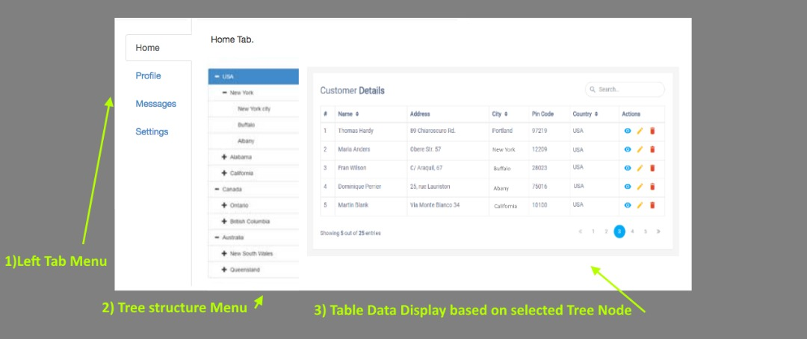

# edesk-application-task
A development task for edesk job application purpose. 

## Requirements
1. Create a **ReactJS project**
2. **Create the component / page based on the mockup screen** attached:
  - When clicked on the **View button** in the table data -> **show/print out the data according to the row**.
  - You may put in sample JSON data for your table.
3. In the profile tab, add a **simple login form** with:-
  - 2 fields:
    - UserID
    - Password
  - 1 Submit Button
    - When clicked on the button, **show/print out the form data**
4. ***Library*** required to use:
  - Bootstrap
  - React Hook Form
  - React Router (Optional)
  
